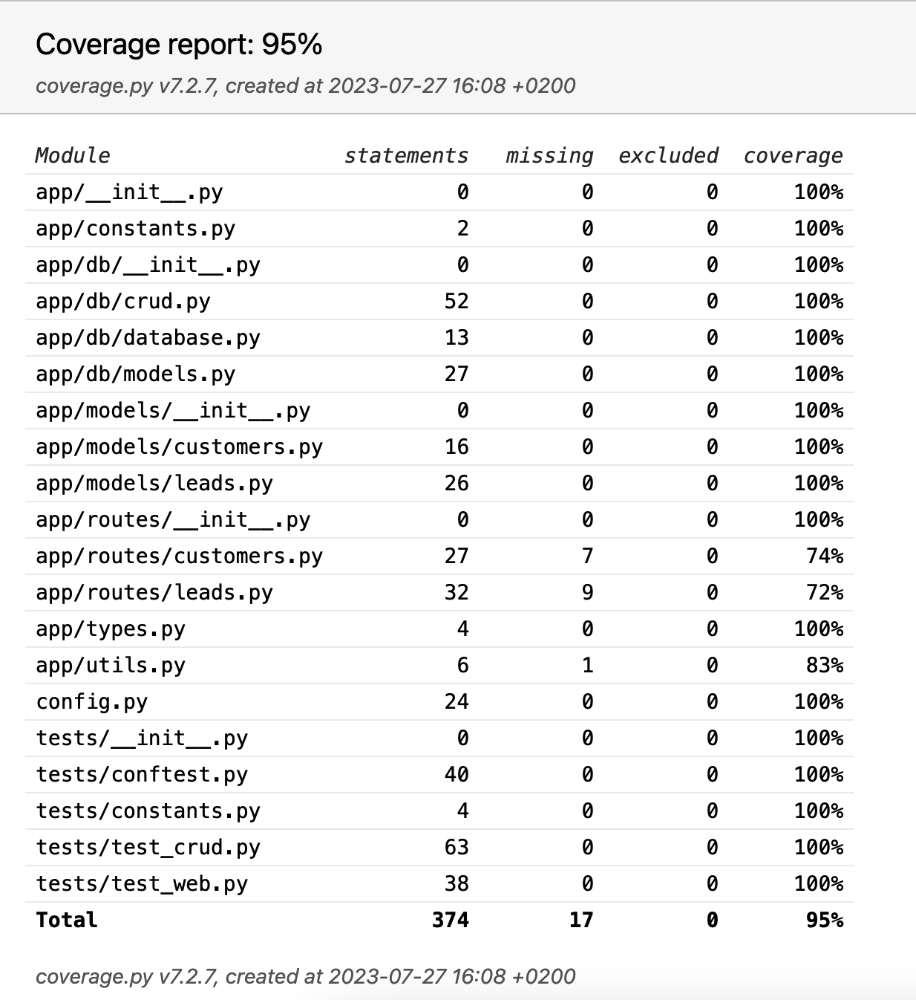

# Piper AI CRM - Simple CRUD Service
A service that supports simple CRUD operations for an in-house CRM system, maintaining data about existing customers and 
sales opportunities (leads).

## Assumptions
- The service is not responsible for the authentication or authorization of the user. Assuming an authentication service 
    is responsible for authenticating the user or implementation should follow.
- The server can have multiple load-balancer instances
- The service has information about existing employees and their roles in order to assign them to different customers / sales opportunities.

## Solution
Using a FastAPI framework, the service exposes a REST API that allows the user to create/read/update/delete 
new customers or sales leads, by calling the appropriate endpoints.
If a lead's status is updated to be 'Won' -> a new customer is automatically created in the database, 
having direct relationship with the lead.

### Database
- The service maintains a PostgreSQL database to keep track of the leads and customers. 
- The database is set up using Alembic, which is a lightweight database migration tool for usage with the SQLAlchemy
database toolkit for Python.

### API
The service exposes a REST API that allows the user to create/read/update/delete new customers or sales leads, 
by calling the appropriate endpoints.
The API is documented using Swagger UI, which is a tool that visually presents the API documentation.
You can access the Swagger UI by opening http://localhost:8000/docs in your browser after running the server.

## Tech Stack
The solution is based on the following technologies:
- [Python](https://www.python.org/)
- [FastAPI](https://fastapi.tiangolo.com/)
- [PostgreSQL](https://www.postgresql.org/)
- [Pytest](https://docs.pytest.org/en/latest/)
- [SQL Alchemy](https://www.sqlalchemy.org/)
- [Alembic](https://alembic.sqlalchemy.org/en/latest/)
- [Pydantic](https://pydantic-docs.helpmanual.io/)
- [Docker](https://www.docker.com/)
- [Docker Compose](https://docs.docker.com/compose/)
- [Swagger UI](https://swagger.io/tools/swagger-ui/)

## Getting Started
### Prerequisites

- [docker](https://docs.docker.com/get-docker/)

### Running the service
- `cd` into the project directory
- Run `docker-compose up --build`
- Open http://localhost:8000/docs to see the API documentation and run the endpoint using the Swagger UI
  - Click on [Try it out] 
  - Then [Execute] to run some endpoints with some data if needed.

### Testing & Static Code Analysis
- `cd` into the project directory
- Run `make check` to run the tests and static code analysis 
[The current test coverage is 95%]

# Summary
This isn't a complete solution. If I had more time, I would have done the following:
### TODO:
- [ ] Store Employees data in a new database table and add a relationship between the leads/customers and the employees
with a verification that the employee exists in the database before assigning it to a lead/customer
- [ ] Add more tests
- [ ] Add verification of duplicated entries in the database using a set of unique fields that could identify a lead/customer
- [ ] Add more user-input-validations. For example, the email field is verified but some other fields are not.
- [ ] Add authentication and authorization
- [ ] Add more tests to full coverage. Currently, 95% is covered.
- [ ] Deploy the service to a cloud provider
- [ ] Add more logging
- [ ] Add CI/CD
- [ ] Add more error handling
- [ ] Add more documentation

### Notes
It's also possible to run the service locally without Docker, by following these
instructions:
1. Install PostgreSQL: `brew install postgresql`
2. Create a db called "qonto": `createdb qonto`
3. Set up the environment variables in a new `.env` file (follow the .env.example file):
4. Create a virtual environment: `python -m venv venv`
5. Activate the virtual environment: `source venv/bin/activate`
6. Install the dependencies: `make requirements start`

Thanks for the opportunity, and I'm looking forward to hearing your feedback!
